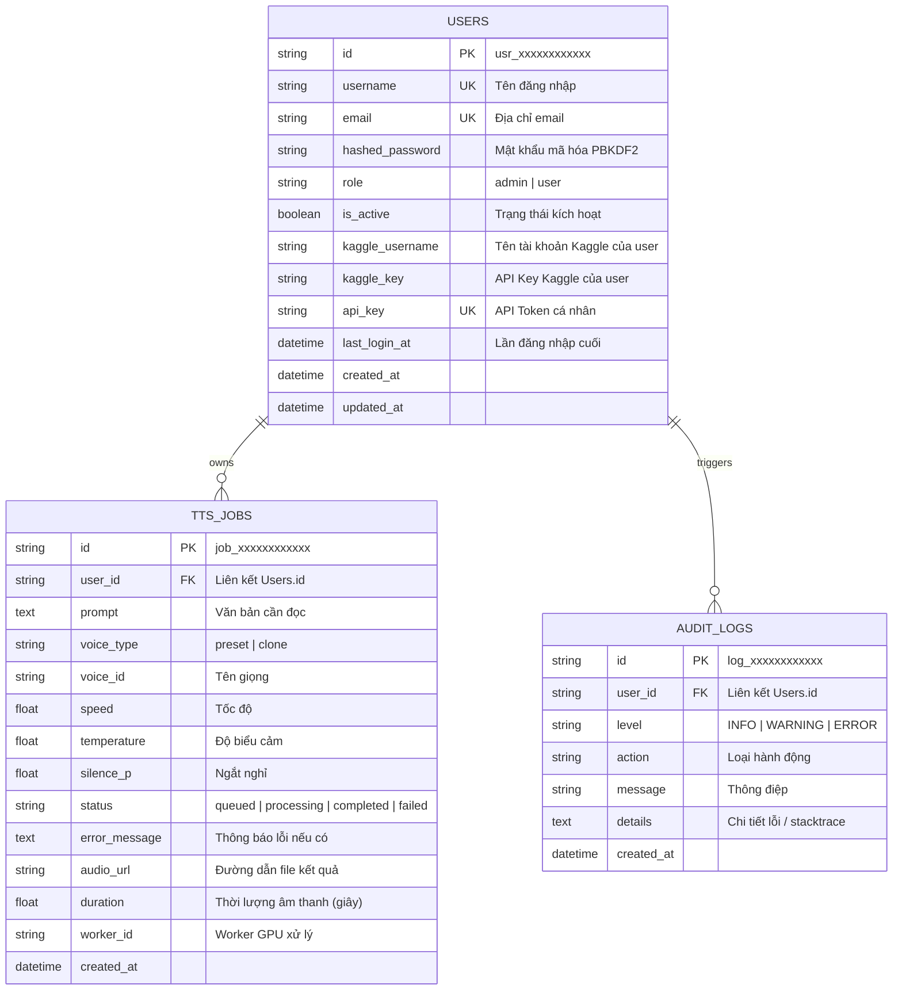

# Kiến Trúc Triển Khai Production Cho OlokaTTS (Go Production Architecture)

> [!IMPORTANT]
> Tài liệu này mô tả chi tiết kiến trúc sản xuất (Production-ready) cho OlokaTTS, giải quyết bài toán chi phí hạ tầng thông qua mô hình **Bring-Your-Own-Key (BYOK) Kaggle** và xây dựng hệ thống quản trị, phân quyền, thống kê báo cáo chuyên nghiệp.

---

## 1. Tổng Quan Kiến Trúc Sản Xuất (Architecture Overview)

```mermaid
flowchart TD
    subgraph ClientLayer [Tầng Trình Duyệt / Ứng Dụng Khách]
        U[Người dùng cuối]
        A[Quản trị viên Admin]
        Dev[Lập trình viên API]
    end

    subgraph GatewayLayer [OlokaTTS Gateway - Hugging Face Space]
        Auth[Dịch vụ Xác thực & Phiên làm việc\nCookie HTTP-Only / Bearer API Key]
        Studio[OlokaTTS Studio & Web UI]
        UserSettings[Trang Cài đặt & BYOK Kaggle Key]
        AdminModule[Phân hệ Quản trị:\nNgười dùng • Thống kê • Log lỗi]
        JobQueue[Hàng đợi TTS Jobs & Điều phối]
        DB[(SQLite / PostgreSQL\nUsers • Jobs • Presets • Logs)]
    end

    subgraph KaggleBYOK [Hạ Tầng GPU Kaggle Đa Người Dùng]
        KaggleUser1[Tài khoản Kaggle User A\n(Dual T4 GPU - 30h/tuần miễn phí)]
        KaggleUser2[Tài khoản Kaggle User B\n(Dual T4 GPU - 30h/tuần miễn phí)]
        KaggleAdmin[Tài khoản Kaggle Admin / Hệ thống\n(Fallback)]
    end

    U --> Studio
    U --> UserSettings
    A --> AdminModule
    Dev --> Auth

    Studio --> JobQueue
    UserSettings --> DB
    AdminModule --> DB
    JobQueue --> DB

    JobQueue -- "Điều phối Worker bằng Key của User A" --> KaggleUser1
    JobQueue -- "Điều phối Worker bằng Key của User B" --> KaggleUser2
    JobQueue -- "Dự phòng hệ thống" --> KaggleAdmin
```

---

## 2. Các Phân Hệ Cốt Lõi (Core Modules)

### A. Phân Hệ Xác Thực & Phân Quyền (Authentication & RBAC)
1. **Mô hình tài khoản (`User` Model):**
   - Định danh: `id`, `username`, `email`.
   - Bảo mật mật khẩu: Sử dụng chuẩn mã hóa công nghiệp **PBKDF2-HMAC-SHA256** với muối ngẫu nhiên (salt) 16 bytes và 100.000 vòng lặp (chuẩn khuyến nghị của NIST).
   - Phân quyền (Role-Based Access Control):
     - **Admin**: Toàn quyền quản trị người dùng, xem toàn bộ log lỗi, thống kê toàn hệ thống, cấu hình tham số chung.
     - **User**: Sử dụng Studio, clone giọng, quản lý job cá nhân, cấu hình Kaggle Key của bản thân.
   - Phiên làm việc (Session): Cookie bảo mật HTTP-Only + hỗ trợ `Authorization: Bearer <API_KEY>` cho tích hợp code/API.
   - Khởi tạo mặc định: Tự động tạo tài khoản `admin` khi hệ thống khởi chạy lần đầu.

2. **Các trang giao diện:**
   - `/login`: Đăng nhập với giao diện glassmorphic cao cấp, ghi nhớ phiên làm việc.
   - `/register`: Đăng ký tài khoản mới kèm kiểm tra tính hợp lệ của mật khẩu và tên đăng nhập.
   - `/logout`: Hủy phiên và xóa cookie an toàn.

---

### B. Mô Hình Tự Cấu Hình Key Kaggle (Bring-Your-Own-Kaggle - BYOK)
> [!TIP]
> **Lợi thế lớn nhất:** Kaggle cung cấp miễn phí **30 giờ GPU (Tesla T4 x 2)** mỗi tuần cho từng tài khoản người dùng. Khi mỗi người dùng tự nạp API Key của họ, hệ thống OlokaTTS có thể mở rộng phục vụ hàng nghìn người dùng mà **không tốn bất kỳ chi phí GPU nào của máy chủ trung tâm!**

1. **Trang cài đặt người dùng (`/settings`):**
   - Biểu mẫu nhập:
     - `Kaggle Username` (Tên tài khoản Kaggle).
     - `Kaggle Key` (API Token từ `kaggle.json`).
   - Nút **"Kiểm tra kết nối Kaggle"**:
     - Gọi trực tiếp Kaggle API để kiểm tra tính hợp lệ của token.
     - Kiểm tra trạng thái GPU Quota khả dụng.
     - Hiển thị badge trạng thái trực quan: `Đã kết nối` / `Chưa cấu hình` / `Key không hợp lệ`.
   - Hướng dẫn trực quan từng bước:
     1. Truy cập `https://www.kaggle.com/settings/api`.
     2. Bấm nút **"Create New Token"** để tải về tệp `kaggle.json`.
     3. Mở tệp và dán `username` cùng `key` vào OlokaTTS.

2. **Quy trình điều phối TTS với BYOK:**
   - Khi người dùng bấm "Tạo Giọng Nói":
     - Nếu người dùng chưa cấu hình Kaggle Key: Hiển thị hộp thoại nhắc nhở dẫn trực tiếp vào `/settings` (hoặc chuyển sang chế độ Local CPU nếu được bật).
     - Nếu đã cấu hình: Gateway sẽ kích hoạt Kernel của chính người dùng đó trên Kaggle (`{user.kaggle_username}/olokatts-worker`) bằng thông tin xác thực của họ.
     - Worker kết nối ngược về Gateway kèm định danh phiên của người dùng để kéo đúng job của họ.

---

### C. Phân Hệ Quản Trị Hệ Thống (Admin Dashboard)
Chỉ hiển thị cho người dùng có quyền `admin`:

1. **Quản lý người dùng (`/admin/users`):**
   - Bảng danh sách thành viên với tìm kiếm và phân trang:
     - Tên đăng nhập, Email, Vai trò (`admin` / `user`).
     - Trạng thái Kaggle Key (Đã cài đặt hay chưa).
     - Trạng thái tài khoản (Hoạt động / Bị khóa).
     - Thời gian tạo và lần đăng nhập cuối.
   - Các hành động quản trị:
     - Khóa / Mở khóa tài khoản người dùng (`toggle active`).
     - Nâng quyền / Hạ quyền (`Promote to Admin` / `Demote to User`).
     - Đặt lại mật khẩu người dùng khi cần.

2. **Báo cáo & Thống kê (`/admin/analytics`):**
   - Các chỉ số KPI tổng quan:
     - **Tổng số người dùng** & Số người dùng đang hoạt động trong ngày/tuần.
     - **Tổng số Job đã tạo** & Tổng thời lượng audio đã tổng hợp (giờ/phút).
     - **Tỷ lệ thành công** (Success Rate) vs **Tỷ lệ lỗi** (Error Rate).
     - **Tốc độ xử lý trung bình** (Average Real-Time Factor).
   - Biểu đồ phân bố giọng đọc phổ biến nhất (Top 5 Preset Voices).
   - Bảng theo dõi các phiên GPU Worker đang online / heartbeat.

3. **Xem & Phân tích Log lỗi (`/admin/logs`):**
   - Bảng sự kiện lỗi hệ thống:
     - Cấp độ: `ERROR`, `WARNING`, `CRITICAL`.
     - Tên người dùng và Job ID liên quan.
     - Thông báo lỗi vắn tắt và Thời điểm xảy ra.
   - Hộp thoại xem chi tiết Traceback / Stacktrace giúp chẩn đoán nguyên nhân (do Kaggle timeout, lỗi định dạng văn bản, hoặc GPU OOM).
   - Bộ lọc theo cấp độ lỗi và tìm kiếm theo Job ID / Người dùng.

---

## 3. Lược Đồ Cơ Sở Dữ Liệu Chi Tiết (Database Schema)



---

## 4. Lộ Trình Triển Khai Kỹ Thuật (Implementation Roadmap)

| Bước | Hạng mục | Chi tiết thực hiện |
| :--- | :--- | :--- |
| **Giai đoạn 1** | **Cơ sở dữ liệu & Dịch vụ Bảo mật** | Tạo bảng `User`, `AuditLog`, cập nhật `TTSJob.user_id`. Viết `AuthService` (hash password, JWT/session cookie, seed admin mặc định). |
| **Giai đoạn 2** | **Xác thực & Trang Đăng ký / Đăng nhập** | Xây dựng router `auth.py`, view `login.html`, `register.html`, quản lý phiên làm việc qua HTTP-Only cookie. |
| **Giai đoạn 3** | **Bring-Your-Own-Kaggle (BYOK)** | Tạo trang `/settings`, xây dựng API kiểm tra Kaggle Key người dùng, cập nhật logic tạo Job kiểm tra key người dùng trước khi dispatch. |
| **Giai đoạn 4** | **Phân hệ Quản trị Admin** | Xây dựng các trang `/admin/users`, `/admin/analytics`, `/admin/logs` với đầy đủ bộ lọc, hành động khóa/mở, xem stacktrace lỗi. |
| **Giai đoạn 5** | **Kiểm thử & Đồng bộ Lên Production** | Kiểm thử end-to-end các luồng (User mới -> Đăng ký -> Cấu hình Key -> Tạo TTS -> Admin xem báo cáo/log), commit và push lên Hugging Face Space. |
