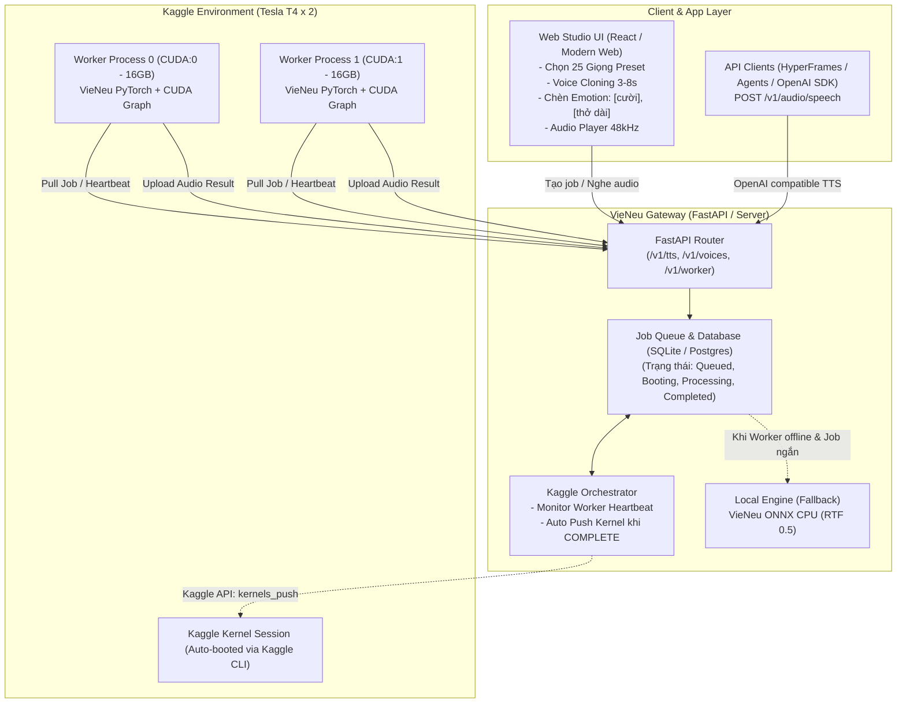

# 🎙️ Kế Hoạch Thiết Kế & Triển Khai VieNeu-TTS Gateway & Web Studio
> **Kiến trúc:** Cloud/Local Gateway (FastAPI) + Pull-based Dual-GPU Worker (Kaggle Tesla T4 x 2) + Fallback ONNX CPU  
> **Kế thừa & Nâng cấp từ:** Dự án `Omnivoice Gateway`

---

## 1. Nghiên cứu & Đánh giá Model VieNeu-TTS

### 1.1. Thông số Kỹ thuật Cốt lõi
- **Tác giả:** Phạm Nguyễn Ngọc Bảo ([pnnbao97/VieNeu-TTS](https://github.com/pnnbao97/VieNeu-TTS)).
- **Phiên bản mã nguồn mở mới nhất:** **VieNeu-TTS v3 Turbo** (Thư viện PyPI: `vieneu` v3.8.3, weights trên Hugging Face `pnnbao-ump/VieNeu-TTS-v3-Turbo`).
  *(Lưu ý: Bản v4 là bản thương mại độc quyền trên vieneu.io để tránh lạm dụng deepfake giọng nói, bản v3 Turbo là bản mở mạnh nhất hiện tại).*
- **Âm thanh đầu ra:** **48 kHz** High-Fidelity (chất lượng vượt trội hoàn toàn so với chuẩn 24 kHz của OmniVoice, F5-TTS hay CosyVoice).
- **Phần cứng & Tốc độ thực tế:**
  - **Trên GPU (PyTorch + CUDA Graph):** RTF ≈ 0.01 – 0.02 (nhanh hơn thời gian thực **50× – 100×** khi batching). Thời gian phản hồi chunk âm thanh đầu tiên (Time-to-First-Audio) chỉ **~115 ms**.
  - **Trên CPU (ONNX Runtime - Torch-free):** RTF ≈ 0.5 (nhanh hơn thời gian thực **2×**). Đây là ưu điểm cực kỳ lớn: hoàn toàn có thể chạy mượt trên CPU máy chủ mà không cần PyTorch.
- **Tính năng nổi bật:**
  1. **25 giọng đọc mẫu tích hợp sẵn** (10 giọng Editors' picks: Phạm Tuyên, Mai Anh, Hải Đăng...) với đủ âm sắc Bắc - Trung - Nam, không bắt buộc người dùng phải upload file mẫu.
  2. **Instant Voice Cloning:** Chỉ cần mẫu audio 3–8 giây (tự động lọc ồn reference audio).
  3. **Emotion & Non-verbal tags:** Hỗ trợ chèn trực tiếp các tag cảm xúc vào văn bản: `[cười]`, `[thở dài]`, `[hắng giọng]`.
  4. **Multi-speaker Conversation Mode:** Cho phép sinh audio hội thoại nhiều nhân vật trong cùng một mẻ (batch).
  5. **Chuẩn OpenAI Speech API:** Tích hợp sẵn endpoint tương thích `POST /v1/audio/speech`.

---

## 2. Bài Học Thực Chiến Từ Omnivoice Gateway & Giải Pháp Cải Tiến

Từ việc phân tích trực tiếp mã nguồn và nhật ký sự cố (`BUG_REPORT_KAGGLE_COMPLETE.md`) của `omnivoice-gateway`:

| Vấn đề ở Omnivoice Gateway | Nguyên nhân & Rủi ro | Giải pháp cải tiến cho VieNeu Gateway |
| :--- | :--- | :--- |
| **Sự cố Kaggle `KernelWorkerStatus.COMPLETE`** | Kernel Kaggle sau một khoảng thời gian idle hoặc hết 9-12h sẽ dừng. Khi Gateway gọi API kiểm tra trạng thái thấy `COMPLETE`, Gateway cũ coi là lỗi và fail ngay job của user. | **Auto-Repush & Graceful Transition:** Khi phát hiện status là `COMPLETE`, `CANCELLED` hoặc `ERROR`, Gateway tự động kích hoạt `kaggle kernels push` để sinh phiên GPU mới; đồng thời giữ job ở trạng thái `booting_kaggle` thay vì đánh dấu `failed`. |
| **Độ trễ Cold-Start (1-2 phút khi Kaggle boot)** | Omnivoice bắt buộc phải có GPU mới chạy được, người dùng phải chờ worker boot và nạp weights lâu. | **Hybrid Fallback (ONNX CPU Local):** VieNeu có bản ONNX CPU cực nhẹ (RTF 0.5). Nếu Kaggle chưa sẵn sàng, hệ thống có thể tùy chọn xử lý ngay trên CPU Gateway cho các câu ngắn/preview, hoặc xếp hàng cho Kaggle T4 batching câu dài. |
| **Lãng phí GPU Kaggle (Tesla T4 x 2)** | Omnivoice chỉ cấu hình chạy trên 1 GPU, bỏ phí GPU thứ 2 của Kaggle. | **Dual-Worker Concurrency:** Kaggle cung cấp 2 GPU Tesla T4 (16GB × 2 = 32GB VRAM). Mỗi worker VieNeu chỉ tốn ~3-4GB VRAM. Ta sẽ khởi chạy **2 worker song song** (Worker 0 ghim `CUDA:0`, Worker 1 ghim `CUDA:1`) -> Tăng gấp đôi công suất xử lý. |
| **Mô hình kết nối** | Mở port từ Kaggle qua Ngrok/Cloudflare dễ bị ngắt kết nối hoặc lỗi token. | **Pull-based Architecture:** Duy trì mô hình Worker chủ động gửi HTTP Polling về Gateway. Tuyệt đối an toàn, vượt qua mọi lớp firewall của Kaggle. |
| **Word Alignment (Phụ đề sync)** | Omnivoice phải chạy qua ASR Whisper phụ trợ để lấy word timestamp. | VieNeu có cơ chế stream và chunk rõ ràng, kết hợp lightweight aligner hoặc tích hợp thẳng vào HyperFrames pipeline. |

---

## 3. Kiến Trúc Hệ Thống Tổng Thể



---

## 4. Thiết Kế Chi Tiết Các Phân Hệ

### 4.1. Phân Hệ Kaggle Dual Worker (`kaggle_worker/`)
- **Tận dụng 2x Tesla T4:**
  - Script điều phối khởi chạy 2 tiến trình con bằng Python `multiprocessing` hoặc 2 subprocess:
    - Tiến trình 1: `CUDA_VISIBLE_DEVICES=0 python worker.py --worker-id t4_gpu_0`
    - Tiến trình 2: `CUDA_VISIBLE_DEVICES=1 python worker.py --worker-id t4_gpu_1`
  - Cả 2 tiến trình độc lập pull job từ Gateway. Khi có nhiều request, 2 GPU chạy song song không nghẽn.
- **Tối ưu VRAM & CUDA Graph:**
  - Sử dụng cơ chế warmup fused graph của VieNeu (`warm_fused()`), giúp inference các lượt sau đạt tốc độ tối đa ~115ms.
- **Heartbeat & Keep-Alive:**
  - Gửi heartbeat mỗi 15-30 giây kèm thông số GPU (VRAM usage, nhiệt độ) về Gateway.

### 4.2. Phân Hệ Gateway Backend (`backend/`)
- **FastAPI Core:**
  - `POST /v1/tts/jobs`: Nhận yêu cầu tạo audio (hỗ trợ voice preset, clone từ file, emotion tags).
  - `GET /v1/tts/jobs/{id}`: Polling tiến độ (`queued` -> `booting_kaggle` -> `processing` -> `completed`).
  - `GET /v1/tts/jobs/{id}/audio`: Stream hoặc tải file WAV 48kHz.
  - `POST /v1/audio/speech`: OpenAI drop-in endpoint.
  - `GET /v1/voices`: Danh sách 25 giọng có sẵn + giọng clone đã lưu.
- **Internal Worker Endpoints:**
  - `POST /api/worker/heartbeat`: Đăng ký worker và cập nhật trạng thái sống.
  - `POST /api/worker/jobs/pull`: Worker nhận job đang chờ.
  - `POST /api/worker/jobs/{id}/complete`: Worker đẩy kết quả audio về Gateway.
- **Kaggle Orchestrator thông minh:**
  - Quản lý phiên Kaggle qua Kaggle API (`KAGGLE_USERNAME`, `KAGGLE_KEY`).
  - Tự động phát hiện khi worker bị tắt hoặc chuyển sang `COMPLETE` để kích hoạt `kernels_push`.

### 4.3. Phân Hệ Giao Diện Web Studio (`frontend/`)
- **Giao diện hiện đại, tối ưu trải nghiệm người dùng (UX/UI):**
  - **Khu vực Trình soạn thảo văn bản (Studio Editor):**
    - Khung nhập text đa dòng với các nút nhanh (Emotion Chips): `[cười]`, `[thở dài]`, `[hắng giọng]` để chèn ngay vào vị trí con trỏ.
    - Điều chỉnh tốc độ, độ dài dừng câu.
  - **Bộ chọn Giọng đọc (Voice Selector):**
    - Tab 1: **25 Giọng Chuẩn** (chia rõ theo Miền Bắc, Miền Trung, Miền Nam; Giọng Nam / Nữ; có audio nghe thử mẫu).
    - Tab 2: **Voice Cloning** (kéo thả file WAV/MP3 3-8s hoặc bấm nút ghi âm trực tiếp qua micro trình duyệt).
    - Tab 3: **Hội thoại (Conversation)** (tạo kịch bản đối đáp nhiều nhân vật).
  - **Trình phát Audio Waveform 48kHz:**
    - Nghe trực tiếp trên web với waveform trực quan, thanh chỉnh âm lượng, nút tải file WAV chất lượng cao.
  - **Thanh trạng thái Hệ thống (System Health Bar):**
    - Hiển thị trực quan: `Kaggle GPU 1 (T4): Active`, `Kaggle GPU 2 (T4): Active`, `Local Engine: Ready`.

---

## 5. Lộ Trình Triển Khai Cụ Thể (5 Phase)

```
[Phase 1] Core VieNeu & Kaggle Worker Setup
   ↓
[Phase 2] Gateway Backend & API Endpoints
   ↓
[Phase 3] Kaggle Orchestrator & Auto-Push Engine
   ↓
[Phase 4] Web Studio Frontend (UI / UX)
   ↓
[Phase 5] Kiểm Thử E2E, Tối Ưu Dual-T4 & Hoàn Thiện
```

### Phase 1: Chuẩn bị Lõi VieNeu & Kịch bản Kaggle Worker
1. Thiết lập môi trường thử nghiệm thư viện `vieneu` và kiểm tra tải weights từ Hugging Face.
2. Viết script `worker.py` hỗ trợ pull job, xử lý infer VieNeu v3 Turbo (cả preset voice và clone voice).
3. Đóng gói script chạy song song trên 2 GPU: `CUDA:0` và `CUDA:1`.

### Phase 2: Xây dựng Gateway Backend (FastAPI)
1. Khởi tạo cấu trúc dự án `vieneu-gateway` tại thư mục scratch.
2. Thiết lập cơ sở dữ liệu SQLite (Job Queue, Voice Samples, Worker Sessions, Settings).
3. Xây dựng các Router: Jobs, Audio, Voices, Worker API và OpenAI compatibility.
4. Tích hợp cơ chế fallback CPU ONNX cục bộ khi cần.

### Phase 3: Hoàn thiện Kaggle Orchestrator
1. Xây dựng module sinh dynamic notebook (`kaggle_notebook_builder.py`).
2. Tích hợp Kaggle API để quản lý trạng thái (`starting`, `running`, `COMPLETE`).
3. Khắc phục triệt để lỗi `KernelWorkerStatus.COMPLETE` đã đúc kết từ Omnivoice.

### Phase 4: Thiết kế & Xây dựng Giao diện Web Studio
1. Xây dựng giao diện Web trực quan (React + Vite + Tailwind hoặc Fullstack FastAPI Template).
2. Tích hợp các bộ lọc giọng 3 miền, upload audio clone giọng, audio waveform preview.
3. Tích hợp bảng điều khiển giám sát trạng thái Kaggle Worker và hàng đợi job.

### Phase 5: Tích hợp Toàn diện, Benchmark & Bàn giao
1. Kiểm thử trọn vẹn quy trình (End-to-End): Web UI -> Gateway -> Kaggle 2x T4 -> Audio 48kHz.
2. Đo đạc tốc độ thực tế (RTF) và khả năng xử lý đồng thời trên 2 GPU.
3. Viết tài liệu hướng dẫn vận hành chi tiết.

---

## 6. Đề Xuất & Quyết Định Cần Xác Nhận
Trước khi bắt đầu code triển khai:
1. **Vị trí lưu trữ dự án:** Đề xuất tạo thư mục `C:\Users\admin\.gemini\antigravity\scratch\vieneu-gateway`.
2. **Kaggle API Credentials:** Bạn đã có sẵn `KAGGLE_USERNAME` và `KAGGLE_KEY` để tự động hóa việc đẩy worker lên Kaggle chưa?
3. **Frontend Stack:** Bạn muốn giao diện dạng **React + Vite + Tailwind** (như Omnivoice Gateway Dashboard) hay dạng **FastAPI Fullstack Jinja2/Tailwind** (đóng gói tất cả trong 1 app Python duy nhất cực kỳ tiện)?
